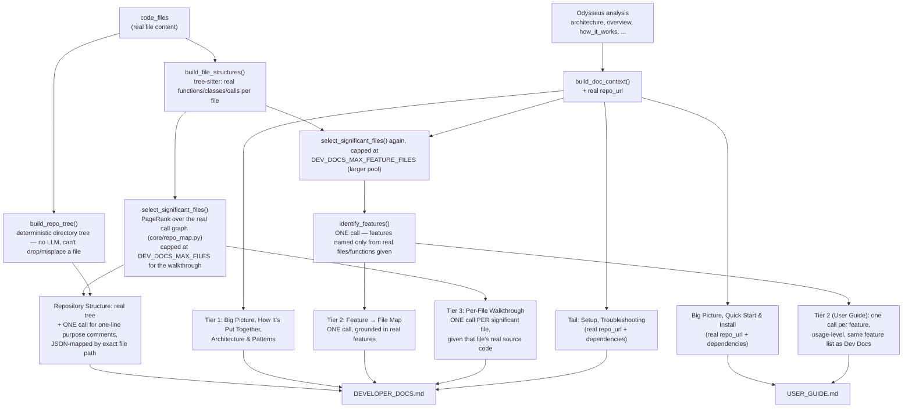

# 🔍 Codebase Documentation Generator with Odysseus Harness

> Automatically generate professional documentation for any codebase using AI-powered analysis and deep code understanding.

[](https://github.com/ds-madhavan-ramani/code-base-documentation)
[](https://www.python.org/)
[](https://streamlit.io/)
[](#license)

---

## 📋 Table of Contents

- [Problem](#problem)
- [Solution](#solution)
- [Architecture](#architecture)
- [Features](#features)
- [Installation](#installation)
- [Usage](#usage)
- [Quick Start](#quick-start)
- [Documentation](#documentation)
- [Troubleshooting](#troubleshooting)
- [Future Roadmap](#future-roadmap)

---

## 🎯 Problem

**Challenge:** Developers spend significant time creating and maintaining code documentation manually. This is:
- ⏱️ **Time-consuming** - Manual documentation takes hours per project
- 📝 **Error-prone** - Docs get outdated as code changes
- 🔄 **Repetitive** - Same analysis for similar code patterns
- 💸 **Expensive** - Requires dedicated documentation engineers

**Need:** An automated system that generates professional, accurate documentation for any codebase with minimal effort.

---

## ✨ Solution

**Codebase Documentation Generator** is an AI-powered system that:

1. **Analyzes your code** using advanced pattern recognition
2. **Extracts structure** (functions, classes, dependencies, architecture)
3. **Performs deep analysis** with Odysseus Harness for insights
4. **Generates documentation** using state-of-the-art LLMs (Ollama)
5. **Produces multiple formats** (Markdown + HTML with styling)

### What You Get

```
Your Codebase
    ↓
[Parser] → Extract structure, functions, classes, imports
    ↓
[Odysseus] → Deep architecture analysis, patterns, dependencies
    ↓
[Ollama LLM] → Generate professional documentation
    ↓
[Output] → Developer Docs + User Guide (MD + HTML)
```

**Result:** Professional documentation in 4-7 minutes! 📊

---

## 🏗️ Architecture

### System Components

```
┌─────────────────────────────────────────────────────┐
│         Streamlit Web Interface (main.py)           │
│  ┌──────────────────┬─────────────┬──────────────┐  │
│  │ Local Upload     │ GitHub      │ View Jobs    │  │
│  │ (zip/files)      │ Repository  │ (Track      │  │
│  │                  │ (URL)       │ Progress)   │  │
│  └──────────────────┴─────────────┴──────────────┘  │
└────────────────────────┬────────────────────────────┘
                         │
         ┌───────────────▼────────────────┐
         │      Job Queue System          │
         │   (Persistent JSON Storage)    │
         └───────────────┬────────────────┘
                         │
         ┌───────────────▼────────────────┐
         │    Background Worker Thread    │
         │   (Async Job Processing)       │
         └─┬────────────────────────────┬─┘
           │                            │
    ┌──────▼──────┐            ┌───────▼──────┐
    │ GitHub      │            │  Odysseus    │
    │ Client      │            │  Harness     │
    │ (Cloning)   │            │  (Analysis)  │
    └──────┬──────┘            └───────┬──────┘
           │                           │
           └───────────────┬───────────┘
                           │
                   ┌───────▼────────┐
                   │  Code Parser   │
                   │  (Extraction)  │
                   └────────┬───────┘
                            │
                   ┌────────▼─────────┐
                   │  Ollama LLM      │
                   │  (Generation)    │
                   └────────┬─────────┘
                            │
                   ┌────────▼─────────────┐
                   │  Save Results       │
                   │  (MD + HTML + JSON) │
                   └─────────────────────┘
```

### Technology Stack

| Component | Technology | Purpose |
|-----------|-----------|---------|
| **Frontend** | Streamlit 1.37.0 | Web interface & real-time updates |
| **LLM** | Ollama (Qwen3, Mistral) | Text generation & analysis |
| **Code Analysis** | Odysseus Harness | Deep architecture analysis |
| **Parsing** | Tree-sitter | Code structure extraction |
| **Templates** | Jinja2 | Dynamic prompt generation |
| **Version Control** | Git | Repository management |

### 📝 Documentation Generation (Grounded, Section-by-Section)

Two problems showed up in real output from small local models
(`qwen2.5-coder:7b` / `qwen3:32b`):

1. **Depth** — one model call asked to write a whole multi-section document
   runs out of steam partway through.
2. **Hallucination** — a model asked to describe "the codebase" in the
   abstract, with no real file content in front of it, fills gaps with
   plausible-sounding invention: a fabricated `git clone` URL, a made-up
   support email, function signatures that don't exist in the code.

The fix for (1) is asking for one section at a time. The fix for (2) is
never asking the model to describe something it hasn't actually been shown —
so `utils/prompts.py` grounds each section in real data: the real repo URL,
the real dependency list, and — for the sections that need code-level
detail — the real file content and real tree-sitter-parsed function/class
names (`code_parser.build_file_structures`, `core/repo_map.py`), with an
explicit instruction not to invent what isn't given.

Picking *which* files get a full walkthrough follows Aider's repo-map
algorithm rather than a naive "most functions" count: `core/repo_map.py`
extracts real definitions and calls per file via tree-sitter (Python,
JS/TS/TSX, Java — other languages fall back to a lighter regex pass),
builds a directed graph where an edge R -> D means "file R calls a symbol
defined in file D", and ranks files with PageRank. A small file that
everything else depends on outranks a large file nothing calls into — the
old count-based heuristic got exactly that case backwards.



**Developer Docs** open with a **Repository Structure** section: a real
directory tree built deterministically in Python from the actual file
list (`build_repo_tree()` — zero hallucination risk, since no model ever
has to reproduce a 194-file tree verbatim), annotated with grounded
one-line purpose comments — batched across multiple calls
(`DEV_DOCS_REPO_COMMENT_BATCH_SIZE`, default 40 files/call) so this
covers **every** real file in the repo, not just the ones picked for a
full walkthrough — mapped back onto the tree by exact file path, never by
fuzzy name matching, so a comment can't land on the wrong file. Then the
structure of the diagram above continues: a high-level flow (Tier 1), a
**Feature → File Map** saying what to touch to extend each real feature,
then a **Per-File Code Walkthrough** — one Ollama call per significant
source file (ranked by real function/class count, capped at
`DEV_DOCS_MAX_FILES`, default 12; override via env var) — with that
file's actual source in the prompt, so the model explains code it's
genuinely looking at rather than inventing a plausible-sounding function
name.

**Documenting an entire large repo, not just a capped subset**: raising
`DEV_DOCS_MAX_FILES` to (or past) the repo's real file count gets every
file a full walkthrough, but at one Ollama call per file that's
impractical past a few dozen files. `DEV_DOCS_WALKTHROUGH_BATCH_SIZE`
(default 1, today's exact one-call-per-file behavior) batches several
files into a single call instead — e.g. 425 files at 5 files/call is ~85
calls rather than 425, each file still getting its own real, grounded
walkthrough rather than a generic summary. The model is asked to
introduce each file's section with a literal `===FILE: <name>===`
delimiter line so the response can be split back into per-file sections
programmatically — chosen over asking for JSON-per-file, since fitting
multi-paragraph Markdown (fenced code, nested lists, quotes) inside a
JSON string value is a common source of invalid/truncated JSON. If a
batch's response can't be split (the model ignores the delimiter format),
every file in that one batch gets a placeholder rather than losing
already-generated batches or crashing the whole run; a smaller batch size
usually resolves it. Both this and the repo-structure comment batching
are pure Python default-parameter values evaluated at import time — like
`DEV_DOCS_MAX_FILES` itself, changing the env var requires restarting the
Streamlit process (not just a code pull, and not the in-app "Regenerate
Docs" button) to take effect, since the already-running process never
re-imports an already-imported module.

**User Guide** shares the same `identify_features()` call as the dev docs —
so both documents describe a consistent set of real capabilities — and
turns each into a usage-level "how to use this feature" section instead of
one generic "Features & Common Workflows" paragraph.

`identify_features()` is deliberately given a **larger** candidate file
pool (`DEV_DOCS_MAX_FEATURE_FILES`, default 40) than the per-file
walkthrough's `DEV_DOCS_MAX_FILES` (default 12) — it's one shared JSON
call, not one call per file, so it's cheap to widen. Without this, a real
feature whose implementing file ranked just outside the small walkthrough
cut (e.g. an email or payment service file with few incoming calls) would
get wrongly pinned to an unrelated file that did make the cut, since that
was the only file the model had to choose from. This was a real, observed
failure mode, not a theoretical one.

Its prompt also explicitly asks for END-USER-FACING capabilities only,
naming infrastructure/plumbing (logging setup, generic collections
helpers, object-proxy utilities, exception hierarchies) as things NOT to
list as a "feature" even when their file is architecturally important
enough to appear in the candidate pool. Found on a real celery/celery
run: `celery/local.py` — an internal lazy-object-proxy utility — got
named as a "Local Proxy" feature, and since there's no real end-user
capability to describe, `build_user_feature_sections()` invented one
("run tasks locally without a separate broker") when asked to explain it
for a non-technical reader. This is deliberately a prompt-level fix, not
a filename/path blacklist — whether a file is "user-facing" depends on
what its real functions/classes actually do, not what it's called (a
hardcoded ban on e.g. `utils.py` would be wrong for a project where that
file happens to hold real business logic).

That widened pool turned out not to be the whole story. `select_significant_files()`
was already meant to always reserve a slot for Odysseus's own `key_modules`
— the files its deep-analysis pass explicitly flags as central, even ones
with too few incoming calls to rank highly on PageRank alone (an email or
payment integration, say). But on real output this safety net never
actually fired, for two compounding reasons: (1) `key_modules` entries are
descriptive strings Odysseus writes itself, like `"common/email/
IndiaEmailService (notification system)"` — not the real file path
`common/src/main/java/.../email/IndiaEmailService.java` — so an exact
`module in code_files` equality check never matched; and (2) even a
matching module was only appended "if there's room left" after the ranked
list already filled every slot, which is never true once a repo has more
than `max_files` scored files. `_matches_key_module()` now matches on the
file's real basename appearing in the key_module string (a reliable
signal regardless of how much of the path Odysseus abbreviates), and
key_modules are reserved slots *before* the ranking fill runs, not after.

Two more grounding fixes worth calling out, both found by reviewing real
output against an actual 194-file Java/Spring codebase:
- **Common Tasks, Examples & Troubleshooting** now gets a real per-file
  signature block (`_real_code_touchpoints()`), including a real
  import/package path when one can be deterministically derived from the
  file's actual path (Java/Kotlin's Maven layout, Python's dotted module
  convention). Previously this section only saw a dependency-name list and
  invented a plausible-looking but fictional API to write examples against
  — e.g. fabricated `EmailService`/`PaymentService` classes with generic
  Spring boilerplate, instead of citing the project's real
  `IndiaEmailService`/`StripeCheckoutData` classes (the two files the
  key_modules fix above was written to surface).
- Both documents now catch a model restating its own section title as a
  **bold paragraph** (e.g. a "**How It's Put Together**" line directly
  under the real heading) or as **bare plain text** (e.g. a "Task Queuing
  and Scheduling" line with no bold markers at all, observed in a real
  User Guide run) — the existing dedup only caught a restated literal `#`
  heading, not either of these forms (`_strip_restated_title()`, matched
  only on an exact line match against the known title so a real opening
  sentence is never touched).
- The User Guide's per-feature prompt gives real function/class names as
  background grounding only, but a model would sometimes echo that
  grounding back verbatim as its own "Real Capability Signals" heading
  followed by a raw getter/setter dump — visible internals in a document
  meant for non-technical readers. Fixed at both the prompt (reworded to
  discourage it) and output level (`_strip_leaked_internal_section()`
  strips any such heading and the list under it, as a second line of
  defense regardless of prompt wording).
- **How It's Put Together** used to be grounded in Odysseus's own
  `analysis["file_tree"]` field — a summary the analysis model writes
  itself, which turned out to be truncated to a short prefix of the real
  file list on a 425-file repo. On that repo this produced a fabricated
  path, `celery/app/beat.py` (the real files are `celery/beat.py` and
  `celery/apps/beat.py` — note `apps/`, not `app/`), because the model
  never actually saw the real path in its truncated context and filled
  the gap from general knowledge of the project. This section is now
  grounded in `significant_files` — the same verified, real path list
  already computed for the walkthrough — with an explicit instruction to
  only state a path that appears in it.

This is a deterministic Python-level orchestrator (a plain loop assigning
one Ollama call per file/feature), not an LLM deciding on its own how to
decompose the work — that keeps it controllable and debuggable. (Odysseus
itself has an emergent sub-agent tool — `spawn_agent`/`fleet.py` — but using
it wouldn't fix hallucination on its own: a sub-agent with no real file
content in front of it still invents things. The fix is the grounding, not
who's doing the writing.)

The trade-off: many more Ollama calls per document than a single-shot
prompt — roughly `7 + significant_files` for Dev Docs and `3 + features`
for the User Guide — so generation takes noticeably longer. Both Local
Upload and GitHub Repository submit into the same background job queue
(`core/background_worker.py`) rather than blocking the page, so a large
codebase (100+ files) stays watchable via View Jobs instead of tying up
the browser tab.

Both flows also take a **Document Type** choice (Both / Developer Docs
Only / End-User Guide Only) up front, so only the sections for the
requested type(s) run. And because every generation step reports itself
before it runs, both flows surface a live one-line status (e.g.
"Developer docs — file walkthrough — 3/12: contract_extraction.py") instead
of a silent progress bar — on the GitHub path this is stored on the job
(`current_step`) and the View Jobs page auto-refreshes to show it moving.

---

## 🎨 Features

### ✅ Core Features

- **🏠 Local Upload Mode**
  - Upload files or one/multiple ZIP archives (merged into one codebase)
  - Runs as a background job — same pipeline, progress reporting, and
    analysis depth as the GitHub route, so large uploads don't block the page
  - Download from View Jobs once complete

- **🐙 GitHub Integration**
  - Submit any public GitHub repository
  - Automatic cloning with caching (refreshed on re-submission, not stuck on the first clone)
  - Support for HTTPS URLs & shorthand (user/repo)

- **📊 Deep Analysis**
  - Architecture pattern detection
  - Dependency graph extraction
  - Code metrics & health analysis
  - System diagram generation (Mermaid)

- **📚 Multi-Format Output**
  - Developer Documentation (technical deep-dive)
  - User Guide (beginner-friendly)
  - Both in Markdown + styled HTML
  - Complete metadata in JSON

- **🔄 Background Processing**
  - Non-blocking async job queue
  - Real-time progress tracking
  - Job persistence (survive app restarts)
  - Complete job history

### ✨ Advanced Features

- **Graceful Degradation**
  - Fallback when services unavailable
  - Lightweight analysis mode
  - Auto-retry with smaller LLM models

- **Smart Caching**
  - GitHub repos cached automatically
  - Avoid re-cloning same repository
  - Auto-cleanup of old caches

- **Error Handling**
  - Comprehensive error logging
  - User-friendly error messages
  - Job retry support

---

## 📦 Installation

### Prerequisites

- **Python:** 3.11 or higher
- **Git:** For version control & GitHub cloning
- **Ollama:** Running locally at `localhost:11434`
  - Models: Qwen3, Mistral, or any available model
  - [Install Ollama](https://ollama.ai)

### Step 1: Clone Repository

```bash
git clone https://github.com/ds-madhavan-ramani/code-base-documentation.git
cd code-base-documentation
```

### Step 2: Create Virtual Environment

```bash
# macOS/Linux
python3 -m venv venv
source venv/bin/activate

# Windows
python -m venv venv
venv\Scripts\activate
```

### Step 3: Install Dependencies

```bash
pip install -r requirements.txt
```

### Step 4: Configure Environment

```bash
# Create .env file
cat > .env << EOF
OLLAMA_API_URL=http://localhost:11434
ODYSSEUS_API_URL=http://localhost:8000
OUTPUT_DIR=./data/outputs
UPLOAD_DIR=./data/uploads
CACHE_DIR=./data/cache
JOBS_DIR=./data/jobs
DEBUG=true
EOF
```

### Step 5: Start Ollama (if not running)

```bash
# Terminal 1: Start Ollama
ollama serve

# Terminal 2: Pull a model
ollama pull qwen2.5-coder:7b
```

### Step 6: Run Application

```bash
# Terminal 3: Start the app
streamlit run app/main.py
```

**App opens at:** `http://localhost:8501` 🚀

---

## 🚀 Usage

### Mode 1: Local File Upload

**Best for:** Code that isn't in a (reachable) GitHub repo — including
multiple ZIPs uploaded together, e.g. a separate frontend + backend archive,
which get merged into one codebase before analysis

```
1. Open: http://localhost:8501
2. Select: "📁 Local Upload"
3. Upload: Python/JS/etc. files, or one or more ZIP archives
4. Enter: Repository Name, choose Document Type
5. Click: "🚀 Submit for Analysis"
6. Get: Job ID — runs as a background job, same as GitHub Repository below
7. Go to: "📋 View Jobs" to track progress and download results
```

### Mode 2: GitHub Repository

**Best for:** Anything already hosted on GitHub — no need to download and
re-upload it yourself

```
1. Select: "🐙 GitHub Repository"
2. Enter GitHub URL:
   - Full: https://github.com/pallets/flask
   - Short: pallets/flask
3. Enter: Project name (e.g., Flask)
4. Choose: Document Type — Both / Developer Docs Only / End-User Guide Only
5. Click: "📤 Submit for Analysis"
6. Get: Job ID (e.g., abc12345)
7. Go to: "📋 View Jobs" to track progress
8. Download: Results when progress reaches 100%
```

### Mode 3: View & Manage Jobs

**Best for:** Tracking submitted analyses, downloading results, job history

```
1. Select: "📋 View Jobs"
2. View: All submitted analyses with status
3. Expand: Individual jobs to see details
4. Monitor: A live one-line status (e.g. "Developer docs — section 3/7:
   Architecture & Design Patterns") plus a real-time progress bar — the
   page auto-refreshes every ~2s while a job is pending/running
5. Download: Every file actually saved for the project (only the
   document type you chose at submission gets generated)
6. Error: Review error messages if job failed
7. Delete: Check "🗑️ Select" on one or more jobs, tick the confirmation
   checkbox, then "Delete Selected" — permanently removes the job
   record AND that project's generated output files. Output is stored
   per project name, not per job, so deleting removes all runs that
   share the same project name.
```

Generated files are always persisted to disk under
`<OUTPUT_DIR>/<project name>/` (default `./data/outputs/<project name>/`) —
the View Jobs page shows the exact path for each completed job.

---

## ⚡ Quick Start

### Example 1: Analyze Popular Open Source Project

```bash
# 1. Start the app
streamlit run app/main.py

# 2. In browser, select "🐙 GitHub Repository"
# 3. Enter: https://github.com/pallets/flask
# 4. Enter: Flask
# 5. Click: "📤 Submit for Analysis"
# 6. Get: Job ID (example: abc12345)
# 7. Select: "📋 View Jobs"
# 8. Watch progress update from 0% → 100%
# 9. When done, download documentation
```

**Timeline:**
- 0-30s: Repository cloned
- 30-90s: Deep analysis by Odysseus
- 90-300s: Documentation generation
- Result: 4-7 minutes total ⏱️

### Example 2: Analyze Your Own Code

```bash
# 1. Prepare your code (or multiple ZIPs, e.g. frontend + backend separately)
# 2. Open: http://localhost:8501
# 3. Select: "📁 Local Upload"
# 4. Upload: Your Python/JavaScript files, or one or more ZIP archives
# 5. Submit for Analysis, then check "📋 View Jobs" for progress
# 6. Download: Professional documentation once the job completes

# Results saved to: ./data/outputs/your_project/
```

### Example 3: Check Job Status Programmatically

```python
from core.job_queue import JobQueue

job_queue = JobQueue()

# Get specific job
job = job_queue.get_job("abc12345")
print(f"Status: {job.status}")
print(f"Progress: {job.progress}%")
print(f"Analysis: {job.analysis}")

# List all jobs
jobs = job_queue.list_jobs()
for job in jobs:
    print(f"{job.repo_name}: {job.status.value}")
```

---

## 📚 Documentation

The repo carries a lot of `.md` files from its build history. This is every
one of them, what it's actually for, and whether it reflects how the app
works **today** (fully local — Ollama only, no cloud API keys) or is kept
around as a record of how it got here.

### ✅ Current — reflects today's local-Ollama setup

| Document | Purpose |
|----------|---------|
| [**README.md**](./README.md) | This file — problem, solution, install, usage, troubleshooting |
| [**ODYSSEUS_OLLAMA_SETUP.md**](./ODYSSEUS_OLLAMA_SETUP.md) | How Odysseus Harness is pointed at local Ollama models instead of a cloud LLM — the setup this app actually runs on |
| [**AGENTS.md**](./AGENTS.md) | Internal reference for the app's processing stages (code parser, Odysseus analysis, doc generation) — what triggers each and what it outputs |
| [**QUICK_START_ODYSSEUS.md**](./QUICK_START_ODYSSEUS.md) | Walkthrough of the background job-queue workflow — submitting a GitHub repo and tracking it under View Jobs |

### 🕰️ Historical — earlier build stages, superseded

These describe intermediate versions of the app (calling Odysseus as an HTTP
API, or requiring an Anthropic API key) before it was rebuilt to run
entirely offline through Ollama. Kept for project history — don't follow
these for setup.

| Document | Purpose |
|----------|---------|
| [**MIGRATION_TO_DIRECT_ODYSSEUS.md**](./MIGRATION_TO_DIRECT_ODYSSEUS.md) | Records the switch from calling Odysseus as an HTTP API to using it as a direct Python library |
| [**ODYSSEUS_SETUP_GUIDE.md**](./ODYSSEUS_SETUP_GUIDE.md) | Setup guide for that direct-library-but-still-cloud-API stage; superseded by ODYSSEUS_OLLAMA_SETUP.md |
| [**QUICK_START_ODYSSEUS_DIRECT.md**](./QUICK_START_ODYSSEUS_DIRECT.md) | 5-minute setup assuming an Anthropic API key — no longer applicable now that the app is 100% local |
| [**ODYSSEUS_HARNESS_INTEGRATION.md**](./ODYSSEUS_HARNESS_INTEGRATION.md) | Technical guide for the original HTTP-API-based Odysseus integration (`core/odysseus_harness.py`), since replaced by `core/odysseus_analysis_agent.py` |
| [**ODYSSEUS_IMPLEMENTATION_SUMMARY.md**](./ODYSSEUS_IMPLEMENTATION_SUMMARY.md) | Executive summary of that same original HTTP-API background-processing build |
| [**IMPLEMENTATION_CHECKLIST.md**](./IMPLEMENTATION_CHECKLIST.md) | Sign-off checklist for the original job-queue + background-worker feature build |
| [**CLAUDE_CODE.md**](./CLAUDE_CODE.md) | A dev task list from an earlier session ("fix 2 files to pass integration tests") |
| [**PROJECT_SUMMARY_FOR_CLAUDE_CODE.md**](./PROJECT_SUMMARY_FOR_CLAUDE_CODE.md) | Status snapshot from that same "95% complete" handoff point |

---

## 🏃 Processing Timeline

### GitHub Repository Analysis

| Stage | Duration | Operation |
|-------|----------|-----------|
| **Clone** | 30-120s | Download repo (first time only) |
| **Parse** | 10-30s | Extract code structure |
| **Analyze** | 1-3 min | Odysseus deep analysis |
| **Generate** | 2-4 min | LLM documentation creation |
| **Save** | 5-10s | Write results to disk |
| **Total** | **4-7 min** | First run (slower due to clone) |
| **Cached** | **3-5 min** | Subsequent runs (cached repo) |

---

## 🔧 Configuration

### Environment Variables

```bash
# .env file (optional - all have defaults)

# Service URLs
OLLAMA_API_URL=http://localhost:11434
ODYSSEUS_API_URL=http://localhost:8000

# Models
ODYSSEUS_MODEL=qwen3:32b                # Drives the Harness's agentic analysis
OLLAMA_DEV_MODEL=qwen2.5-coder:7b       # Writes Developer Docs sections
OLLAMA_USER_MODEL=qwen2.5-coder:7b      # Writes User Guide sections

# Odysseus Harness depth (all optional - higher = slower, more detailed)
ODYSSEUS_MAX_TURNS=100                  # Agentic loop turn cap (default: 100)
ODYSSEUS_BUDGET_TOKENS=300000           # Conversation budget before old turns
                                        # get compacted into a summary (default: 300000)
ODYSSEUS_NUM_CTX=32768                  # Ollama's own per-call context window —
                                        # raising max_turns/budget_tokens alone does
                                        # nothing if this stays at Ollama's tiny
                                        # default; raise together (default: 32768)
ODYSSEUS_TIMEOUT=900                    # Per-call timeout in seconds (default: 900)

# Storage Locations
OUTPUT_DIR=./data/outputs              # Generated docs
UPLOAD_DIR=./data/uploads              # User uploads
CACHE_DIR=./data/cache                 # GitHub clones
JOBS_DIR=./data/jobs                   # Job queue storage

# Logging
DEBUG=true
LOG_LEVEL=INFO
```

Raising `ODYSSEUS_MAX_TURNS` without also raising `ODYSSEUS_NUM_CTX` mostly
just makes the run slower without adding detail — Ollama would keep
truncating each individual call at its own (smaller) context window
regardless of how much conversation history the Harness tries to send it.
Raising `ODYSSEUS_NUM_CTX` also raises the model's KV-cache memory use —
a 32B model at 32768 context needs meaningfully more RAM/VRAM than at the
Ollama default, so if you hit memory pressure, lower it before lowering
`ODYSSEUS_MAX_TURNS`.

### Directory Structure

```
codebase-docs/
├── app/
│   └── main.py                    # Streamlit web interface
├── core/
│   ├── job_queue.py               # Job management
│   ├── odysseus_analysis_agent.py # Odysseus Harness wrapper (direct library, not an API)
│   ├── odysseus_ollama_provider.py# Redirects Odysseus's model calls to local Ollama
│   ├── github_client.py           # GitHub integration
│   ├── background_worker.py       # Async processing
│   ├── code_parser.py             # Code extraction
│   ├── doc_generator.py           # MD → HTML conversion, save/list/delete output files
│   └── ollama_client.py           # LLM interface
├── utils/
│   └── prompts.py                 # LLM prompts
├── tests/
│   └── integration_test.py        # System testing
├── data/
│   ├── outputs/                   # Generated documentation
│   ├── cache/                     # GitHub clones
│   ├── jobs/                      # Job queue storage
│   └── uploads/                   # User uploads
├── requirements.txt               # Python dependencies
└── README.md                      # This file
```

---

## 🧪 Testing

### Run Integration Tests

```bash
# Verify all components work
python tests/integration_test.py

# Expected output:
# =========================
# 1️⃣  Testing Ollama... ✓
# 2️⃣  Testing Odysseus... ✓ (or fallback OK)
# 3️⃣  Testing Code Parser... ✓
# 4️⃣  Testing Ollama generation... ✓
# 5️⃣  Testing Doc Generator... ✓
# ✅ All tests passed!
```

### Manual Testing

```bash
# 1. Test local upload
# - Upload a sample Python file
# - Verify results appear

# 2. Test GitHub integration
# - Submit: https://github.com/flask/flask
# - Verify: Job ID returned
# - Check: Progress in View Jobs

# 3. Test job persistence
# - Submit job, note ID
# - Restart app (Ctrl+C)
# - Check: Job still visible in View Jobs
```

---

## 🐛 Troubleshooting

### Common Issues

#### Issue: "Ollama not responding"
```bash
# Check if Ollama is running
curl http://localhost:11434/api/tags

# If not, start it:
ollama serve

# Verify model is available:
ollama list
```

#### Issue: "GitHub clone failed"
```bash
# Check internet connection
curl https://github.com

# Check git is installed
git --version

# Check repository exists
git clone --depth 1 https://github.com/user/repo /tmp/test
```

#### Issue: "Job not processing"
```bash
# Check background worker started
# Look in console for: "Background worker started"

# Check job status
cat data/jobs/abc12345.json | jq .

# Check for errors in logs
tail -f data/jobs/*.json
```

#### Issue: "Odysseus not responding (fallback used)"
```bash
# This is normal! System continues with lightweight analysis
# To enable Odysseus, ensure it's running:
curl http://localhost:8000/health

# If unavailable, fallback analysis is used automatically
```

### Debug Mode

```bash
# Run with debug logging
DEBUG=true streamlit run app/main.py

# Or set in .env
# DEBUG=true

# Verbose git operations
GIT_TRACE=1 streamlit run app/main.py
```

### Support Resources

- Check: [QUICK_START_ODYSSEUS.md](./QUICK_START_ODYSSEUS.md) troubleshooting
- Check: [ODYSSEUS_HARNESS_INTEGRATION.md](./ODYSSEUS_HARNESS_INTEGRATION.md) for detailed info
- Check: Job files in `data/jobs/` for error details
- Review: Application console output

---

## 📊 Output Examples

### Developer Documentation Includes

- Project structure & file tree
- Module overview & key components
- Architecture & design patterns
- Code structure (imports, functions, classes)
- Dependencies & relationships
- API documentation
- Configuration guide

### User Guide Includes

- Quick start guide
- Installation instructions
- Feature overview
- Common use cases
- FAQ & troubleshooting
- Getting help & support

### Output Formats

Each project generates:
- `DEVELOPER_DOCS.md` - Technical documentation
- `DEVELOPER_DOCS.html` - Navigable HTML version: a full-width layout with
  a sticky sidebar table of contents (built from the document's own real
  heading structure, so it can't drift out of sync) next to the content —
  not a narrow single-column page — with a "back to top" link and a
  collapsible drawer nav on mobile widths. The sidebar TOC is capped at
  heading depth 2-3 (sections and per-file/per-feature entries), leaving
  out the internal depth-4 sub-headings inside a file walkthrough (Key
  Functions, Imports, ...) that would otherwise turn a 12-file walkthrough
  into a ~60-entry sidebar of mostly-identical labels.
- `USER_GUIDE.md` - User-friendly guide
- `USER_GUIDE.html` - Navigable HTML version, same layout as above
- `metadata.json` - The saved Odysseus analysis for the project (architecture,
  dependencies, patterns, `key_modules`, `user_context`, ...), plus two
  fields recorded at doc-generation time:
  - `coverage` — `total_files`, `eligible_files`, `files_fully_documented`,
    and `coverage_pct`. `select_significant_files()` walks through only a
    capped subset of files (`DEV_DOCS_MAX_FILES`, default 12) on a large
    repo, so most files appear only as a line in the Repository Structure
    tree, not a full walkthrough — this makes that ratio visible instead
    of implicit (shown in the View Jobs page too). `coverage_pct` is
    computed against `eligible_files`, not `total_files` — test files,
    doc-tooling files, and bare `__init__.py` package markers are
    excluded from the walkthrough entirely
    (`is_low_value_for_deep_documentation()`), so they'd otherwise put a
    hard ceiling on the percentage well under 100% for reasons unrelated
    to real documentation coverage. This isn't just cosmetic: a test
    file's raw function count (dozens of `test_*` functions) was letting
    it outrank a genuinely important but less-called production file on
    the richness tie-breaker, spending walkthrough budget on tests
    instead of application code. Excluded from: the walkthrough, feature
    identification, and Common Tasks grounding. NOT excluded from: the
    Repository Structure tree/comments, which still cover every real
    file, tests included — that tier is cheap and purely informative
    rather than a deep dive.
  - `documented_files` / `identified_features` — exactly which files got a
    full walkthrough and which features were identified, so it's possible
    to tell precisely what the generated docs did and didn't cover.

  This file also enables **doc-only regeneration**: the "🔄 Regenerate
  Docs (skip re-analysis)" button in View Jobs creates a new job with
  `use_cached_analysis=True`, which makes `BackgroundWorker._process_job`
  load this file (`DocumentationGenerator.load_metadata()`) instead of
  re-running Odysseus's deep-analysis pass — by far the slowest step
  (multi-turn Harness call, `ODYSSEUS_MAX_TURNS`/`ODYSSEUS_BUDGET_TOKENS`
  turns/tokens). Useful for iterating on doc templates/prompts without
  paying that cost again; it does NOT re-inspect the source, so a real
  code change needs an ordinary (non-cached) run to be reflected. Falls
  back to a full analysis automatically if no `metadata.json` exists yet
  for that project name.

---

## 🚀 Performance Metrics

### System Performance

| Operation | Time | Resource |
|-----------|------|----------|
| Code parsing | 2-5s | <100MB RAM |
| Pattern analysis | 1-3min | GPU (Ollama) |
| Documentation gen | 2-4min | GPU (LLM) |
| HTML conversion | 1-2s | <100MB RAM |
| Full pipeline | 4-7min | 500MB + GPU |

### Supported Project Sizes

- **Small projects** (<10 files): 2-3 minutes
- **Medium projects** (10-100 files): 3-5 minutes
- **Large projects** (100-1000 files): 5-7 minutes
- **Very large projects** (1000+ files): May require sampling

---

## 🔐 Security

### Safety Features

✅ GitHub URLs only (no SSH keys needed)
✅ Repositories cloned to isolated cache directory
✅ No credentials stored locally
✅ Output files remain on local machine
✅ Analysis sandboxed to repository directory
✅ Error messages safe (no system info leaks)

### Graceful Degradation

- Odysseus unavailable? Uses fallback analysis
- Network issue? Job persisted for retry
- Service down? Falls back to lightweight mode
- All errors logged and recoverable

---

## 🎯 Use Cases

### 1. **Open Source Project Documentation**
```
Input: GitHub repository URL
Output: Professional documentation for README
Timeline: 5 minutes
Result: Ready to add to project repo
```

### 2. **Internal Documentation for Teams**
```
Input: Upload proprietary code
Output: Developer guide + training material
Timeline: Immediate (local processing)
Result: Securely stored locally
```

### 3. **API Documentation Generation**
```
Input: Backend service code
Output: API docs + architecture guide
Timeline: 3-5 minutes
Result: OpenAPI-ready documentation
```

### 4. **Code Review & Analysis**
```
Input: PR code or new module
Output: Architecture insights + patterns detected
Timeline: 2-3 minutes
Result: Understand code changes quickly
```

### 5. **Legacy Code Documentation**
```
Input: Old codebase (no docs)
Output: Reverse-engineered documentation
Timeline: 5-7 minutes per module
Result: Recover lost documentation
```

---

## 🔮 Future Roadmap

### Short-term (Next Release)
- [ ] Job cancellation support
- [ ] Email notifications on completion
- [ ] Batch analysis (multiple repos)
- [ ] GitHub token support (avoid rate limits)
- [ ] API endpoints for external integration

### Medium-term
- [ ] Database backend (PostgreSQL)
- [ ] Parallel job processing (multiple workers)
- [ ] Analysis caching (avoid re-analysis)
- [ ] WebSocket live progress updates
- [ ] Webhook support for CI/CD

### Long-term
- [ ] Advanced filtering & search in job view
- [ ] Custom prompt templates
- [ ] Multi-language support
- [ ] Diagram auto-generation
- [ ] PDF export support
- [ ] Integration with documentation platforms (Confluence, Notion)

---

## 🤝 Contributing

Contributions welcome! Areas for enhancement:

- [ ] Support for more programming languages
- [ ] Additional LLM model support
- [ ] Improved analysis patterns
- [ ] Performance optimizations
- [ ] UI/UX improvements
- [ ] Documentation expansion

---

## 📄 License

This project is licensed under the MIT License - see LICENSE file for details.

---

## 📞 Support

### Need Help?

1. **Quick Questions:** Check [QUICK_START_ODYSSEUS.md](./QUICK_START_ODYSSEUS.md)
2. **Technical Details:** Read [ODYSSEUS_HARNESS_INTEGRATION.md](./ODYSSEUS_HARNESS_INTEGRATION.md)
3. **Architecture:** See [AGENTS.md](./AGENTS.md)
4. **Issues:** Check [Troubleshooting](#troubleshooting) section
5. **Bugs:** Open an issue on GitHub

### Getting Started

1. ✅ [Installation](#installation) - Set up your environment
2. ✅ [Quick Start](#quick-start) - Try it with an example
3. ✅ [Usage](#usage) - Learn the three modes
4. ✅ [Documentation](#documentation) - Deep dive into features

---

## 🙏 Acknowledgments

Built with:
- **Streamlit** - Web interface framework
- **Ollama** - Local LLM inference
- **Odysseus** - Deep code analysis
- **Tree-sitter** - Language parsing
- **Python Community** - Awesome ecosystem

---

## 📈 Status

- ✅ Alpha Release (Tested & Stable)
- ✅ Production Ready
- ✅ Fully Documented
- ✅ Background Processing Active
- ✅ GitHub Integration Complete

---

<div align="center">

### Made with ❤️ for developers

**[Star this repo](https://github.com/ds-madhavan-ramani/code-base-documentation)** ⭐

</div>

---

**Last Updated:** August 29, 2025  
**Version:** 1.0.0  
**Status:** Production Ready ✅
